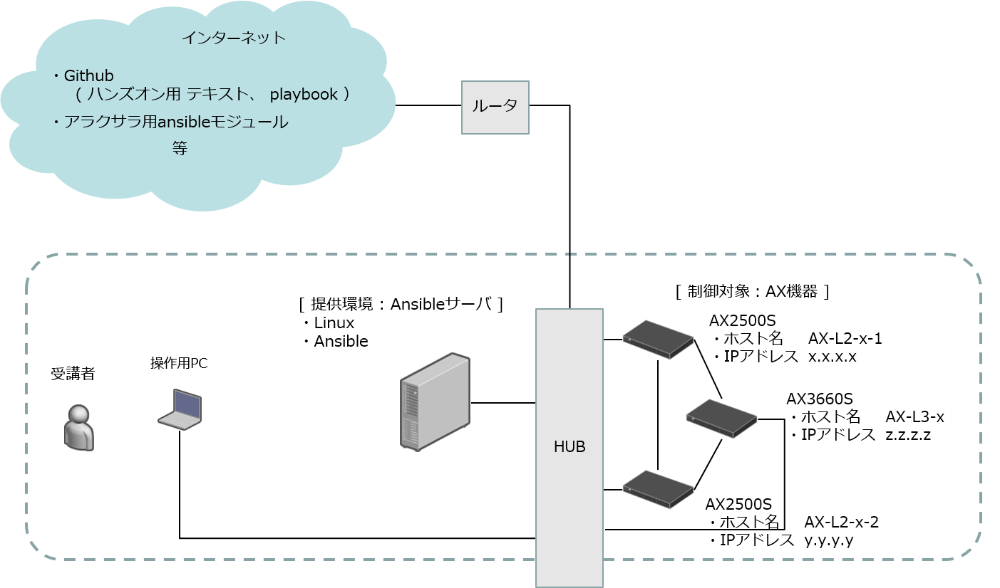

# このドキュメントについて

このドキュメントは、アラクサラネットワークス主催のAnsibleハンズオンセミナーで使用されているテキストです。このテキストによって、アラクサラネットワークスが提供しているAX modules for Ansibleのインストール方法から基本的な使い方を学習できます。

- アラクサラネットワークス主催のAnsibleハンズオンセミナーについては、[こちら](https://www8.hitachi.co.jp/inquiry/alaxala/general/jp/form.jsp)からお問い合わせください。

 

## ハンズオンの内容

- [**演習2.1**　AX modules for Ansibleのインストールと設定](2.1-install.md)

- [**演習2.2**　AX modules for Ansibleの動作確認](2.2-adhoc.md)

- [**演習2.3**　コンフィグのバックアップ](2.3-backup.md)

- [**演習2.4**　VLANの設定](2.4-vlan.md)

- [**演習2.5**　pingを実行し疎通を確認](2.5-ping.md)

- [**演習2.6**　装置の詳細な状態を確認](2.6-parse.md)

- [**演習2.7**　ループ処理](2.7-loop.md)

 

## ハンズオンのネットワーク構成図  

## ハンズオンで使用するソフトウェアのバージョン
- Ansible :  2.7.2
- AX modules for Ansible :  Version 1.2

 

## 参考情報

- [アラクサラホームページ](http://www.alaxala.com/)  
	- アラクサラネットワークスの製品やソリューションを掲載しています。

- [アラクサラ製品のマニュアルページ](http://www.alaxala.com/jp/techinfo/manual/index.html)  
	- アラクサラ製品のマニュアルを掲載したサイトです。本演習で使用するAX modules for Ansibleのマニュアル(AX modules for Ansible運用ガイド)はこのページからダウンロードできます。

-  [アラクサラ会員専用サイト](http://www.alaxala.com/jp/partner/bplogin/index.html)  
	- アラクサラ製品をご活用いただくための有用なツールやドキュメントを掲載したサイトです。本演習で使用するAX modules for Ansibleはこのサイトからダウンロードできます。さらに、このサイトにはネットワーク機器を操作する上で有用なplaybookの記述ノウハウをまとめたガイドブック(AX modules for Ansible活用ガイド)も掲載されています。
	- アラクサラ会員専用サイトはビジネスパートナ様サイトとインテグレータ会員様専用サイトの２つあります。AX modules for AnsibleおよびAX modules for Ansible活用ガイドはいずれのサイトからでも入手することができます。アラクサラの会員専用サイトのアカウントをお持ちでない場合は、[会員専用サイトお申込みサイト](http://www.alaxala.com/jp/member/index.html)からアカウント発行をお申込みください。

License
-------

Copyright &copy; 2018,2019 ALAXALA Networks Corporation. All rights reserved.
